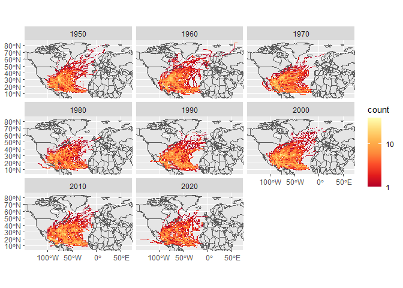

Case Study 09
================
Isabel Liston
Today

Load packages

``` r
library(sf)
library(tidyverse)
library(ggmap)
library(spData)
data(world)
data(us_states)
```

Get hurricane data from NOAA

``` r
dataurl="https://www.ncei.noaa.gov/data/international-best-track-archive-for-climate-stewardship-ibtracs/v04r01/access/csv/ibtracs.NA.list.v04r01.csv"

storm_data <- read_csv(dataurl)
```

Clean up data

``` r
storm_data_yr <- storm_data %>%
                  mutate(Year = year(ISO_TIME)) %>%
                  relocate(Year, .after = ISO_TIME)

storm_data_post_1950 <- storm_data_yr %>%
                          filter(Year >= 1950)

stmdat_post_1950 <- storm_data_post_1950 %>%
                      mutate_if(is.numeric, 
                                function(x)ifelse(x==-999.0,NA,x))

stmdat_post1950_dec <- stmdat_post_1950 %>%
                        mutate(Decade=(floor(Year/10)*10)) %>%
                        relocate(Decade, .after = Year)

spat_stmdata <- stmdat_post1950_dec %>%
                  st_as_sf(coords=c("LON","LAT"),crs=4326)

region <- spat_stmdata %>%
            st_bbox()
```

Plot data

``` r
 ggplot(world)+
  geom_sf()+
  facet_wrap(~Decade)+
  stat_bin2d(data=spat_stmdata,aes(y=st_coordinates(spat_stmdata)[,2],
                              x=st_coordinates(spat_stmdata)[,1]), 
                              bins=100)+
  scale_fill_distiller(palette="YlOrRd", trans="log", direction=-1, 
                       breaks = c(1,10,100,1000))+
  coord_sf(ylim=region[c(2,4)], xlim=region[c(1,3)])+
  labs(x = NULL, y = NULL)
```

<!-- -->

Display the 5 states that have experienced the most hurricanes

``` r
storms_CRS <- st_crs(spat_stmdata) 

us_states_reproj <- st_transform(us_states, crs = storms_CRS)

us_states_reproj_statename <- us_states_reproj %>%
                              select(State = NAME)

storm_states <- st_join(spat_stmdata, us_states_reproj_statename, 
                        join = st_intersects,left = F)

storm_by_state <- storm_states %>%
                  group_by(State) %>%
                  summarize(storms=length(unique(NAME))) %>%
                  arrange(desc(storms)) %>%
                  slice(1:5) %>%
                  st_set_geometry(NULL)

knitr::kable(head(storm_by_state))
```

| State          | storms |
|:---------------|-------:|
| Florida        |     89 |
| North Carolina |     67 |
| Georgia        |     61 |
| Texas          |     56 |
| Louisiana      |     53 |
