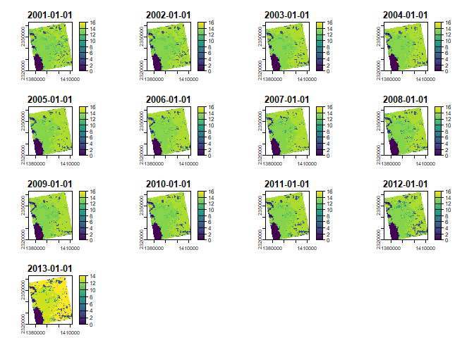
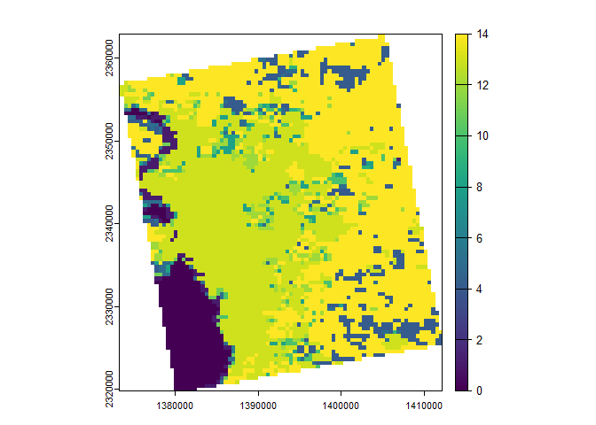
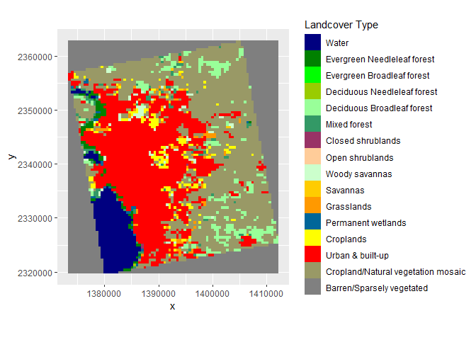
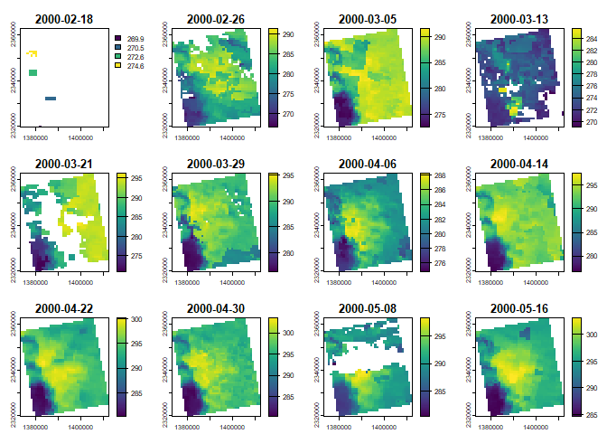
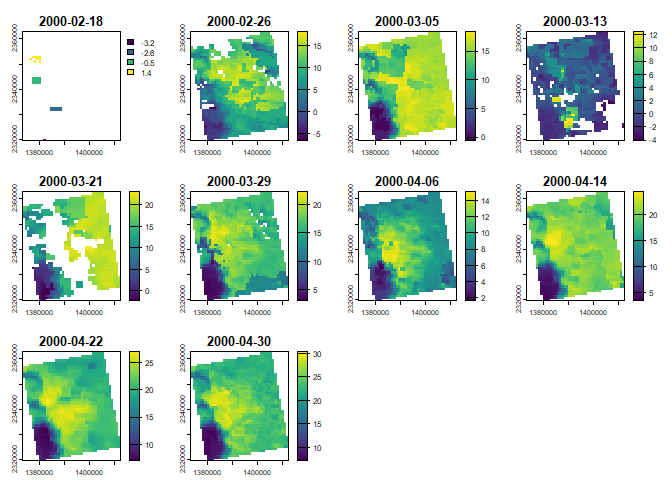
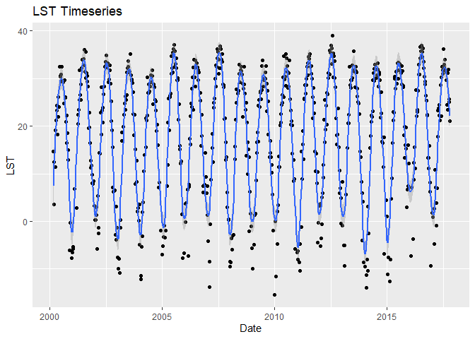
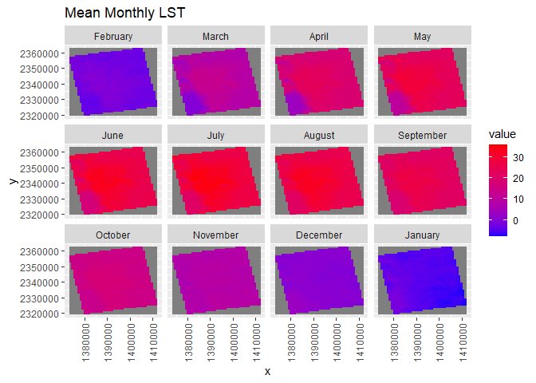
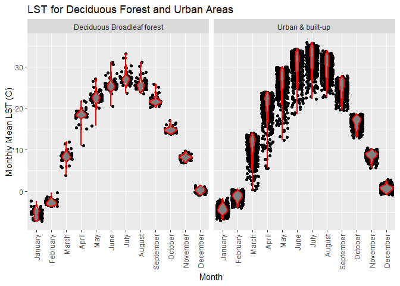

Case Study 10
================
Isabel Liston
November 8, 2024

Load libraries

``` r
library(terra)
#install.packages("rasterVis")
library(rasterVis)
library(ggmap)
library(tidyverse)
library(knitr)
library(sf)
library(ncdf4)
```

Create a data folder and download the lulc data and the lst data

``` r
dir.create("data",showWarnings = F)

lulc_url="https://github.com/adammwilson/DataScienceData/blob/master/inst/extdata/appeears/MCD12Q1.051_aid0001.nc?raw=true"
lst_url="https://github.com/adammwilson/DataScienceData/blob/master/inst/extdata/appeears/MOD11A2.006_aid0001.nc?raw=true"

download.file(lulc_url,destfile="data/MCD12Q1.051_aid0001.nc", mode="wb")
download.file(lst_url,destfile="data/MOD11A2.006_aid0001.nc", mode="wb")
```

Add the downloaded data into R

``` r
lulc=rast("data/MCD12Q1.051_aid0001.nc",subds="Land_Cover_Type_1")
lst=rast("data/MOD11A2.006_aid0001.nc",subds="LST_Day_1km")
```

Plot the lulc data

``` r
plot(lulc)
```

<!-- -->

``` r
#limit data to 2013 
lulc_13=lulc[[13]]
plot(lulc_13)
```

<!-- -->

Assign the landcover classes

``` r
 Land_Cover_Type_1 = c(
    Water = 0, 
    `Evergreen Needleleaf forest` = 1, 
    `Evergreen Broadleaf forest` = 2,
    `Deciduous Needleleaf forest` = 3, 
    `Deciduous Broadleaf forest` = 4,
    `Mixed forest` = 5, 
    `Closed shrublands` = 6,
    `Open shrublands` = 7,
    `Woody savannas` = 8, 
    Savannas = 9,
    Grasslands = 10,
    `Permanent wetlands` = 11, 
    Croplands = 12,
    `Urban & built-up` = 13,
    `Cropland/Natural vegetation mosaic` = 14, 
    `Snow & ice` = 15,
    `Barren/Sparsely vegetated` = 16, 
    Unclassified = 254,
    NoDataFill = 255)

lcd=data.frame(
  ID=Land_Cover_Type_1,
  landcover=names(Land_Cover_Type_1),
  col=c("#000080","#008000","#00FF00", "#99CC00","#99FF99", "#339966", "#993366", "#FFCC99", 
        "#CCFFCC", "#FFCC00", "#FF9900", "#006699", "#FFFF00", "#FF0000", "#999966", "#FFFFFF", 
        "#808080", "#000000", "#000000"),
  stringsAsFactors = F)
# colors from https://lpdaac.usgs.gov/about/news_archive/modisterra_land_cover_types_yearly_l3_global_005deg_cmg_mod12c1
kable(head(lcd))
```

|                             |  ID | landcover                   | col      |
|:----------------------------|----:|:----------------------------|:---------|
| Water                       |   0 | Water                       | \#000080 |
| Evergreen Needleleaf forest |   1 | Evergreen Needleleaf forest | \#008000 |
| Evergreen Broadleaf forest  |   2 | Evergreen Broadleaf forest  | \#00FF00 |
| Deciduous Needleleaf forest |   3 | Deciduous Needleleaf forest | \#99CC00 |
| Deciduous Broadleaf forest  |   4 | Deciduous Broadleaf forest  | \#99FF99 |
| Mixed forest                |   5 | Mixed forest                | \#339966 |

Convert lulc raster to a factorial raster

``` r
# convert to raster 
lulc=as.factor(lulc)

# update the RAT with a left join
levels(lulc)=left_join(levels(lulc)[[1]],lcd)[-1,]
activeCat(lulc)=1
```

Plot lulc factorial raster

``` r
gplot(lulc)+
  geom_raster(aes(fill=as.factor(value)))+
  scale_fill_manual(values=setNames(lcd$col,lcd$ID),
                    labels=lcd$landcover,
                    breaks=lcd$ID,
                    name="Landcover Type")+
  coord_equal()+
  theme(legend.position = "right")+
  guides(fill=guide_legend(ncol=1,byrow=TRUE))
```

<!-- -->

Convert land surface temperature to degrees C

``` r
#plot original data
plot(lst[[1:12]])
```

<!-- -->

``` r
#convert from Kelvin to degrees C
scoff(lst)=cbind(0.02,-273.15)

#plot converted data
plot(lst[[1:10]])
```

<!-- -->

Extract the lst for a point and plot the time series

``` r
#define a new sf point
lw= data.frame(x= -78.791547,y=43.007211) %>% st_as_sf(coords=c("x","y"),crs=4326)

#transform the point to the projection of the raster 
lst_crs <- st_crs(lst)
lw_trans <- st_transform(lw, crs = lst_crs)

#extract the data for the transformed point
lst_point <- terra::extract(lst,lw_trans, buffer=1000,fun=mean,na.rm=TRUE)
lst_point2 <- lst_point[-1]

lst_point3 <- t(lst_point2)

#extract the dates for each layer
dates <- time(lst)

#combine the data frame and the dates
lst_dates <- cbind.data.frame(Date = dates, LST = lst_point3)

#plot the time series
ggplot(lst_dates, aes(x = Date, y = LST)) +
  geom_point() +
  stat_smooth(span = 0.05, n = 811)+
  labs(title = "LST Timeseries")
```

<!-- -->

Calculate the monthly average surface temperature

``` r
#summarize the mean value per month
lst_month <- tapp(lst, index = "month", fun = "mean", na.rm = TRUE)
names(lst_month) <- month.name[as.numeric(str_replace(names(lst_month),"m_",""))]

#plot the monthly averages
gplot(lst_month) +
  geom_tile(aes(fill = value)) +
  facet_wrap(~variable) +
  scale_fill_gradient(low =  "blue", high = "red")+
   labs(title = "Mean Monthly LST")+
  theme(axis.text.x = element_text(angle = 90, vjust = 0.5, hjust=1))
```

<!-- -->

``` r
#calculate the monthly mean for the whole image
monthly_mean_img <- global(lst_month,mean,na.rm=T)
kable(monthly_mean_img)
```

|           |      mean |
|:----------|----------:|
| February  | -2.127506 |
| March     |  8.710271 |
| April     | 18.172077 |
| May       | 23.173591 |
| June      | 26.990005 |
| July      | 28.840144 |
| August    | 27.358260 |
| September | 22.927727 |
| October   | 15.477510 |
| November  |  8.329881 |
| December  |  0.586179 |
| January   | -4.754134 |

Summarize land surface temperature by land cover

``` r
#resample lulc to the lst grid
lulc2 <- resample(lulc, lst, method = "near")

#combine values from lulc2 and lst
lcds1 <- cbind.data.frame(values(lst_month),ID=values(lulc2[[1]]))%>%
                          na.omit()
tidy_lcds <- lcds1 %>%
  gather(key='month',value='value',-Land_Cover_Type_1_1)

#convert ID to numeric and month to ordered factor
tidy_lcds2 <- tidy_lcds %>%
                mutate(ID=as.numeric(Land_Cover_Type_1_1), 
                       month = factor(month,levels=month.name,ordered=T))

#join with the lcd table from beginning
tidy_lcds_joined <- tidy_lcds2 %>%
                      left_join(lcd)

#filter for "Urban & built-up" and "Deciduous Broadleaf forest" 
tidy_lcds_filtered <- tidy_lcds_joined %>%
                        filter(landcover%in%c("Urban & built-up",
                                              "Deciduous Broadleaf forest"))
#plot to illustrate the variability in LST between land cover types
ggplot()+
  geom_point(data = tidy_lcds_filtered, 
             aes(x = month, y = value), 
             position = "jitter")+
  geom_violin(data = tidy_lcds_filtered, 
              aes(x = month, y = value), 
              alpha = 0.5,
              color = "red",
              linewidth = 0.75)+
  facet_wrap(~landcover)+
  labs(title = "LST for Deciduous Forest and Urban Areas",
       x = "Month",
       y = "Monthly Mean LST (C)")+
  theme(axis.text.x = element_text(angle = 90, vjust = 0.5, hjust=1))
```

<!-- -->
